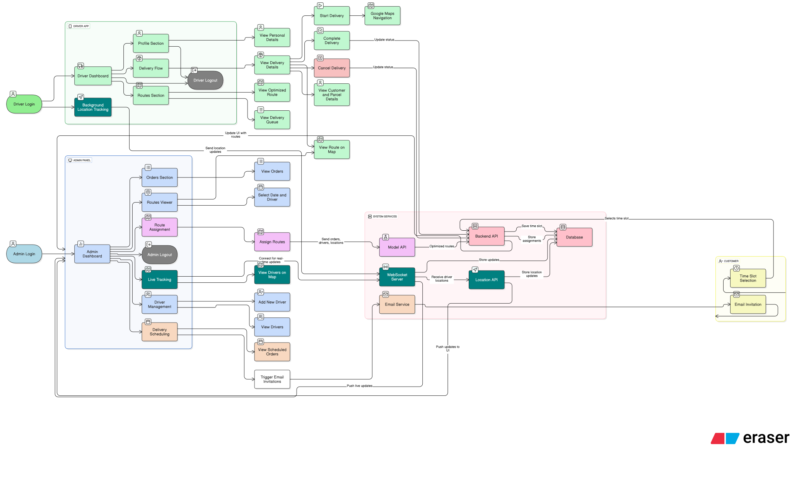
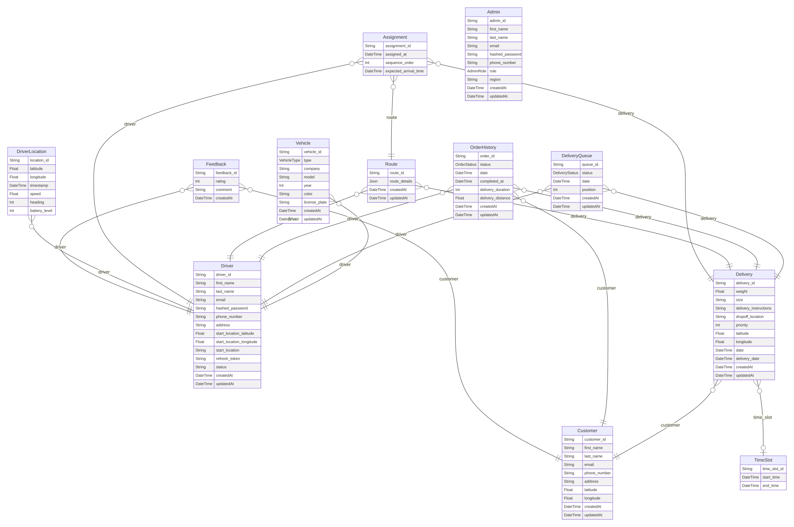

# Parcel Delivery Optimization using Reinforcement Learning Algorithms

## Project Overview

This project optimizes parcel delivery routes using Reinforcement Learning (RL) Algorithms. The goal is to provide an efficient and realistic solution for managing parcel deliveries, incorporating real-world factors like road networks, traffic conditions, and package characteristics. The system includes an admin dashboard for route optimization and assignment, and a driver interface for managing deliveries.

## Project Layout

- Project Architecture



- Project ER Diagram


## Features

### Admin Dashboard (Frontend)

*   Assign deliveries to drivers.
*   Manage carriers (add, view, edit).
*   Manage customers (add, view, edit).
*   View overall dashboard with key metrics.
*   User authentication (login, registration).
*   Optimize delivery routes (likely triggers backend optimization).
*   Manage orders (create, view, update status).
*   View planned routes on a map.
*   Configure application settings.
*   Manage delivery time slots for customers.
*   Live track delivery vehicles on a map.

### Driver Mobile App (driver_frontend)
*   Driver account management (profile, settings).
*   View and manage active deliveries.
*   Detailed view of individual deliveries (customer info, address, time window).
*   Mark deliveries as completed or failed.
*   View assigned route on a map.
*   Navigate to delivery locations (likely integrates with a map app).
*   Dashboard/Home screen with summary information.

### Backend API
*   Handles user authentication and authorization.
*   Manages customer data.
*   Provides data for the admin dashboard.
*   Manages delivery lifecycle (creation, assignment, status updates).
*   Manages driver data and assignments.
*   Sends email notifications (e.g., order confirmation, delivery updates).
*   Manages and serves optimized routes.
*   Live location tracking updates from drivers.

### Reinforcement Learning Route Optimization (RL_gym_environment)
*   Custom OpenAI Gym environment (`UdupiDeliveryEnv`) for simulating deliveries in Udupi.
*   Utilizes real-world road network data (from `data/udupi.graphml`) and delivery details (`data/deliveries.csv`).
*   Agent learns to optimize routes based on:
    *   Current location and time.
    *   Time left in the delivery day (8 AM to 8 PM).
    *   Urgency of nearest delivery deadline.
    *   Number of remaining deliveries.
    *   Delivery time windows.
*   Reward function encourages:
    *   On-time deliveries.
    *   Minimizing travel time and distance.
    *   Prioritizing urgent deliveries.
    *   Completing all deliveries.
    *   Finishing the day early.
*   Tracks metrics: on-time deliveries, off-time deliveries, total distance.

### Google OR-Tools Route Optimization (google_or_tools)
*   Solves Vehicle Routing Problems (VRP).
*   **Single Vehicle Optimization API:**
    *   Provides an API endpoint for optimizing routes for a single vehicle.
    *   Visualizes initial and optimized routes on HTML maps.
*   **Multi-Vehicle Optimization with Time Windows (VRPTW):**
    *   Optimizes routes for multiple vehicles considering delivery time windows.
    *   Provides an API endpoint for multi-vehicle optimization.
    *   Uses CSV files for delivery requests and vehicle details.
    *   Generates HTML reports with optimized multi-vehicle routes.
*   **ML-Enhanced Travel Time:** The main README mentions an "ML Layer to modify the matrix based on several features like day of week, month, is_weekend, is_rush_hour, is_night, temperature, humidity, weather_condition, wind_speed, visibility, package_weight, etc." This is likely used in conjunction with OR-Tools to provide more accurate travel time estimations.

## Technologies Used

-   **Backend:** Node.js, Express.js, TypeScript, Prisma ORM
-   **Frontend (Admin):** Next.js, React, TypeScript, Tailwind CSS
-   **Frontend (Driver):** React Native, Expo
-   **Database:** PostgreSQL
-   **Machine Learning:** Python, Reinforcement Learning Libraries (TensorFlow, PyTorch), Google OR-Tools
-   **APIs:** OpenStreetMap API, Google Maps API, Weather API
-   **Real-time Communication:** WebSocket (Live location tracking)
-   **Authentication:** JWT tokens, bcrypt
-   **Development Tools:** ESLint, Prettier, Android Studio
-   **Version Control:** Git, GitHub

## Project Structure

``` bash
.
├── .gitignore
├── README.md
├── requirements.txt
├── main.py
├── basic_diagram_svg.svg
├── basic_diagram.png
├── detailed diagram.png
├── ERdiagram.svg
├── udupi_delivery_travel_time_data.csv
├── udupi_travel_time_model_20250528_111806.pkl
├── .ipynb_checkpoints/
│   ├── claude-checkpoint.ipynb
│   └── ds-checkpoint.ipynb
├── .vscode/
│   ├── c_cpp_properties.json
│   ├── launch.json
│   └── settings.json
├── backend/
│   ├── main/                       # Main API server
│   │   ├── src/
│   │   │   ├── index.ts
│   │   │   └── routes/
│   │   ├── package.json
│   │   └── prisma/
│   └── live_location_tracking/     # WebSocket tracking API
│       ├── package.json
│       └── src/
├── cache/
├── data/
│   ├── deliveries.csv
│   └── ...
├── driver_frontend/                # Expo React Native app for drivers
│   ├── app/
│   ├── package.json
│   └── README.md
├── frontend/                       # Next.js admin dashboard
│   ├── public/
│   │   └── images/
│   ├── package.json
│   └── src/
├── google_or_tools/
│   ├── requirements.txt
│   └── multi_vehicl_VRPTW/         # Driver assignment model
│       └── app.py
├── notebooks/
├── RL_gym_environment/
├── RL_logs/
├── RL_models/
├── RL_plots/
├── scripts/
└── utils/
```

## Installation and Setup

### Prerequisites

- Node.js (v16 or higher)
- Python (v3.8 or higher)
- Android Studio with Android emulator
- Expo CLI
- All the env variables are filled(mainly the google maps api, weather api keys etc.)

### 1. Admin Frontend (Next.js)

```bash
cd frontend
npm install
npm run dev
```
The admin dashboard will be available at `http://localhost:3000`

### 2. Backend Setup

#### Main API Server
```bash
cd backend/main
npm install
npx prisma generate
npm run dev
```
The main API server will start on port `8000`

#### Live Location Tracking (WebSocket API)
```bash
cd backend/live_location_tracking
npm install
npm run dev
```
The tracking WebSocket API will start on port `4000`

### 3. Driver Assignment Model

```bash
cd google_or_tools/multi_vehicl_VRPTW
pip install -r ../requirements.txt
python app.py
```

### 4. Driver Mobile App (Expo)

#### Setup Android Emulator
1. Install Android Studio
2. Set up an Android Virtual Device (AVD)
3. Start the emulator

#### Run the App
```bash
cd driver_frontend
npx expo install
npx expo run:android
```
The app will be installed and launched on your Android emulator.

### Testing Credentials

For testing the admin dashboard and mobile app, please contact us at `ckeerthankumar4@gmail.com` to obtain login credentials.

## Usage

### Admin Interface

1.  Access the Admin Dashboard through its URL.
2.  Use the "Optimize" feature to calculate the optimal delivery sequences for the day's orders.
3.  Assign the generated routes to available drivers via the "Assignment" section.
4.  Monitor ongoing deliveries using the "Tracking" feature.
5.  Manage "Customers" and "Carriers" information.
6.  Review past deliveries in "Order History".

### Driver App

1.  Open the Expo app on your mobile device.
2.  Log in with your driver credentials.
3.  View your assigned deliveries on the dashboard.
4.  Select a delivery to see detailed route information and customer details.
5.  Use the navigation feature to reach the destination.
6.  Mark the delivery status (complete/incomplete) upon arrival.

## Models

The project utilizes different models for route optimization:

### Model 1: Deep Q Learning

Details about the Deep Q Learning model implementation. (Further information to be added)

### Model 2: Google OR-Tools with ML Layer

This model uses Google's OR-Tools for route optimization, enhanced with a Machine Learning layer. This layer modifies the cost matrix based on several features such as:
    -   Day of the week
    -   Month
    -   Is it a weekend?
    -   Is it rush hour?
    -   Is it night time?
    -   Temperature
    -   Humidity
    -   Weather condition
    -   Wind speed
    -   Visibility
    -   Package weight

This allows the model to learn from custom data and adapt to changing conditions.

### Model 3: To be decided

(Details for a third model will be added here if developed.)

## Admin View Images from the Project


## Driver View Images from the Project


## Contributing

We welcome contributions to improve and expand this project. If you have new features, bug fixes, or improvements, please follow these steps:

1.  Fork the repository.
2.  Create a new branch for your feature or fix.
3.  Make your changes, ensuring clear comments and documentation.
4.  Add relevant tests if applicable.
5.  Submit a pull request for review.

## Future Improvements

- **Cloud Deployment:** Deploy on AWS/GCP/Azure with Docker containerization and CI/CD pipelines
- **Advanced ML Models:** Implement Graph Neural Networks and Multi-Agent RL for better route optimization
- **Mobile Enhancements:** Add offline mode, AR navigation, and real-time delivery photo verification
- **IoT Integration:** Real-time package tracking with sensors and predictive maintenance for vehicles
- **Microservices Architecture:** Break down monolithic services with API gateway and event-driven design
